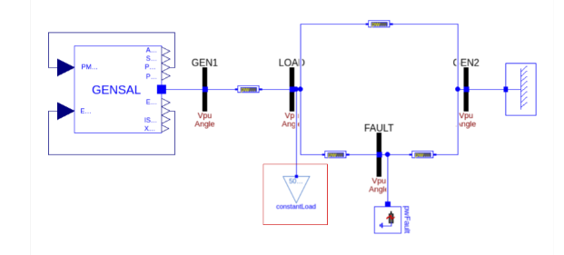

.. OpenIPSL documentation master file, created by
   sphinx-quickstart on Sat May 14 11:50:37 2016.
   You can adapt this file completely to your liking, but it should at least
   contain the root `toctree` directive.

*************************
OpenIPSL's documentation!
*************************

.. image:: img/puppy.png
      :width: 200 px
      :align: right

Welcome to **OpenIPSL** - The Open-Instance Power System Library.

This documentation is the main source of information for **users** and **developers** working with (or contributing to) the **OpenIPSL** project.

OpenIPSL in short
=================

The OpenIPSL or Open-Instance Power System Library is a `Modelica`_ library, fork of of the `iTesla Power System Library`_ developed and maintained by the `SmarTS Lab`_ research group, collaborators and friends (contributions are welcome!).

The library contains a set of power system component models and test power system networks adopting the "phasor" modeling approach.
`Time domain simulations`_ can be carried out using a Modelica-compliant tool, which may also allow to do other computations on the model, for example, `linearization`_ for eigen-analysis and other purposes.

All models in a Modelica library require *initial guess* values that should come from a solution of the steady state of the overall model.
From these values, a Modelica tool solves the initialization problem for all algebraic and differential - state variables.
There are many ways to provide *initial guess* values, but following the standard "workflow" in power system analysis practice, all models in OpenIPSL are programmed in such way that by introducing a `power flow solution`_ (from another tool), the *initial guess* is computed as a parameter within each model and are provided into the initial equations that are used to solve the overall initialization problem.
See `this paper`_ for a more detailed explanation.

Almost all of our models have been developed to provide the same response than a "reference" power system simulation tool, e.g. `PSAT`_ and `PSS/E`_.
You can use these tools to create a power flow solution for your network.
If you do not have access to these tools or do not want to use them, there are several power flow solvers available on Github.
Future work in the OpenIPSL effort will include to generate Modelica "records" from open source power flow solvers such as `GridCal`_ or `PyPSA`_.

Model Verification
------------------

In order to perform the verification there were three different tests that are performed on both PSS/E and Modelica. The one-line-diagram and specifications are outlined below:

- Fault - Three phase fault applied to the bus FAULT.  This test intends to check the dynamic behavior of the Modelica models against the reference models in PSS@E. The main idea is to verify the correspondence of the fast dynamics and non-linearities of the models between the two tools.

.. image:: verification/images/faultcharacteristics.png
      :width: 300 px
      :align: center

.. image:: verification/images/faultdiagram.png
      :width: 300 px
      :align: center

- Load Variation - Variation of the Load in the system at Load Bus. This test intends to verify the similar behavior between the models developed in Modelica and PSS@E focusing on testing the slow dynamics of the systems.

.. image:: verification/images/loadvariationcharacteristics.png
      :width: 300 px
      :align: center

- Reference Step - Step in the Exciter voltage reference. The implementation of this test in Modelica has been performed by modifying the existing base class of the Exciter model. This test intends to validate the Modelica models against PSS@E checking the dynamic behavior, in particular in the saturation region of the components, that is determined by this type of event.

.. image:: verification/images/referencestepcharacteristics.png
      :width: 300 px
      :align: center

Then the models were verified by comparing selected output signals from both tools and comparing them via linear regression and taking into account a small error. The results of all of the verifications can be found in the verifications tab.

Questions or need help?
-----------------------

Check out our :ref:`talk-to-us` page for different ways of getting in touch.

.. toctree::
   :caption: Table of Contents
   :name: mastertoc
   :maxdepth: 2
   :includehidden:

   self
   Publications <publications>
   User Guide <user-guide/get-started>
   Community <community/community-home>
   Technical Documentation <tech-doc/tech-doc-home>
   Verifications <verification/verifications>

Indices and tables
------------------

* :ref:`genindex`
* :ref:`modindex`
* :ref:`search`

.. Links
.. _Modelica: https://www.modelica.org
.. _iTesla Power System Library: https://github.com/itesla/ipsl
.. _SmarTS Lab: https://www.kth.se/en/ees/omskolan/organisation/avdelningar/epe/research/smart-transmission-systems-laboratory-smarts-lab-1.627203
.. _Time domain simulations: https://build.openmodelica.org/Documentation/OpenModelica.Scripting.simulate.html
.. _linearization: https://build.openmodelica.org/Documentation/OpenModelica.Scripting.linearize.html
.. _power flow solution: https://github.com/SmarTS-Lab/Raw2Record
.. _this paper: http://www.ep.liu.se/ecp/article.asp?issue=119&article=010
.. _PSAT: http://faraday1.ucd.ie/psat.html
.. _PSS/E: http://w3.siemens.com/smartgrid/global/en/products-systems-solutions/software-solutions/planning-data-management-software/planning-simulation/pages/pss-e.aspx
.. _GridCal: https://github.com/SanPen/GridCal
.. _PyPSA: https://github.com/FRESNA/PyPSA
